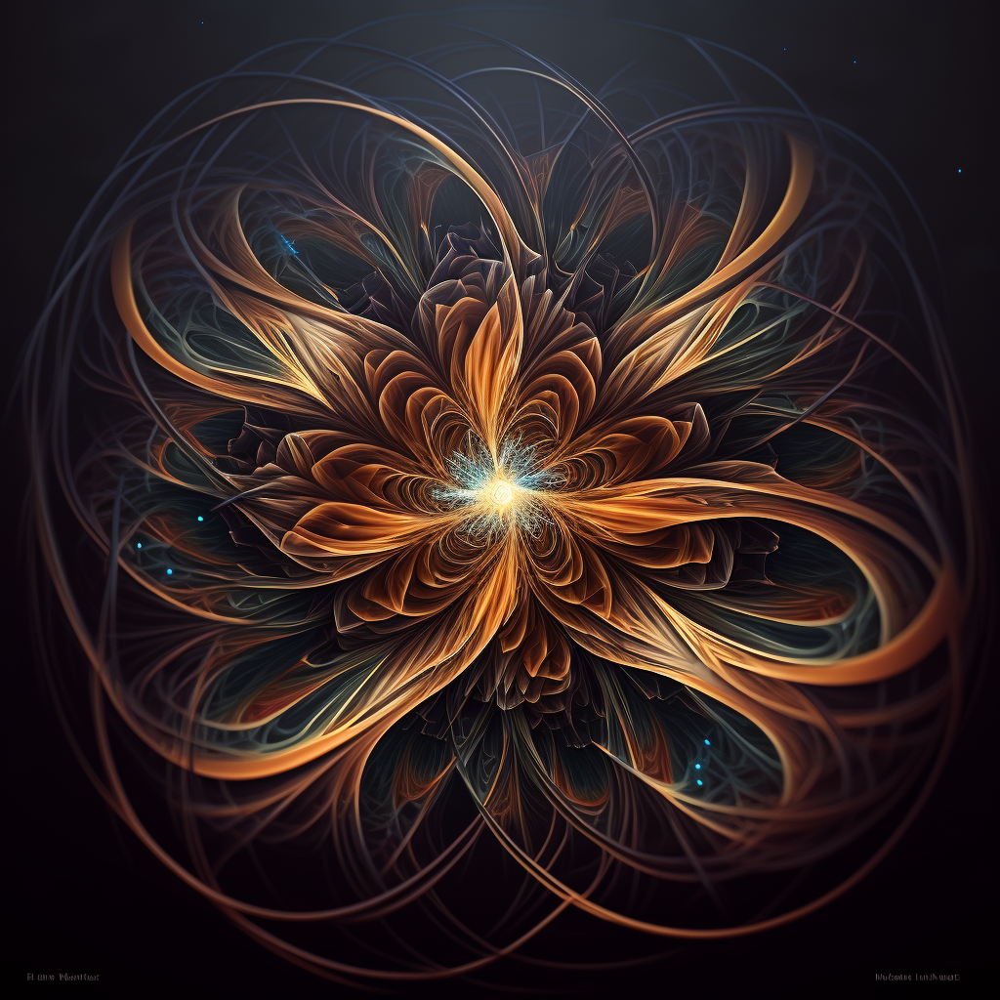
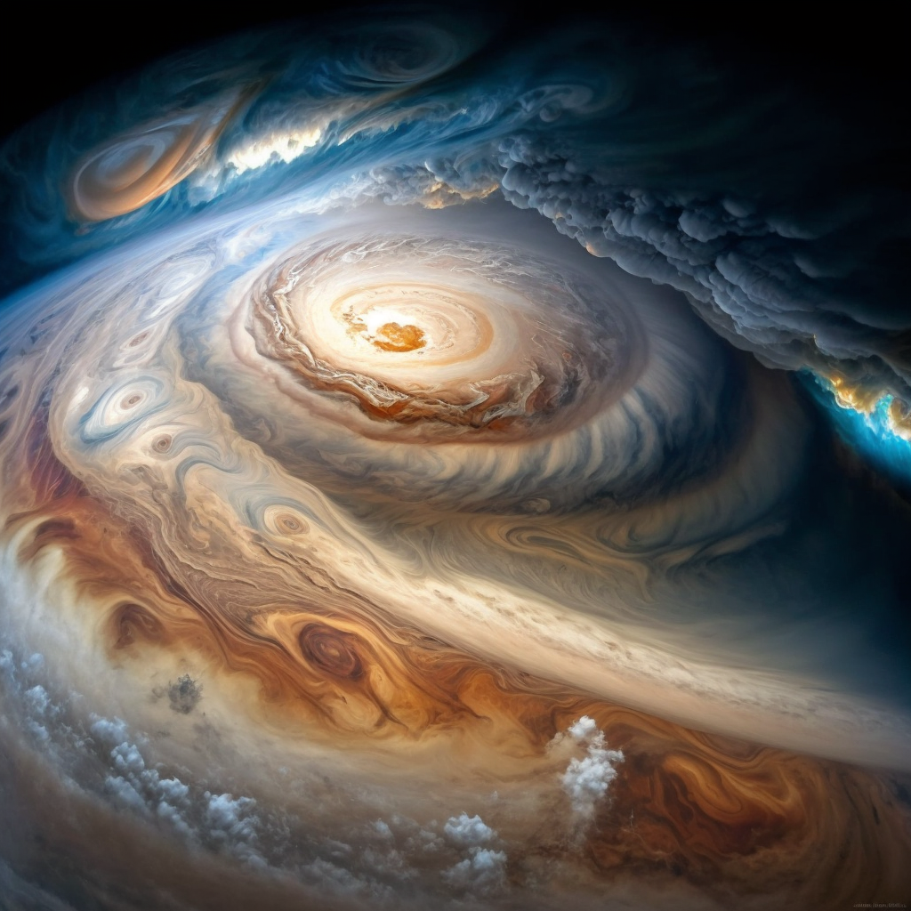

# Mini Science and Engineering Project (2023, SPARK)
1. [Proposal](./Jupeter_Project.md)

# Acknowledgement
1. [Midjourney](https://www.midjourney.com/) for image creation.
2. Wikipedia and NASA for source of information.
  * [Magetic Field](https://www2.jpl.nasa.gov/galileo/jupiter/magnetic_field.html#:~:text=It%20extends%20beyond%20the%20orbit,own%20magnetic%20field%20every%20day.)
  * [Magnetosphere of Jupiter](https://en.wikipedia.org/wiki/Magnetosphere_of_Jupiter)
  * [Jupiter from NASA](https://www.nasa.gov/jupiter)
3. Others
  * [Two Moons and a Magnetosphere](./Two_moons_and_Magnetosphere)

